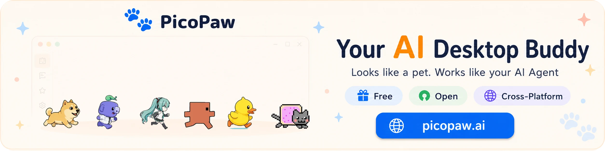

> [!IMPORTANT]
> **Fork note**
>
> This branch is a personal fork that currently carries additional features and behavior on top of `upstream/main`, including:
>
> * **Image generation support:** provider-backed image generation tool and pluggable image generation provider wiring.
> * **Local coding tools:** `apply_patch` for guarded file edits, `search_files` for workspace search with optional gitignore override, and `update_plan` for explicit task progress.
> * **Task-board workflow tracking:** durable `task_board` boards with explicit local/manual step updates, so composite workflows can keep truthful step status without pretending work is still queued.
> * **Planning and search providers:** Gemini web search provider, related web-search UI/config support, and safer provider behavior around unsupported range filters.
> * **Agent / subagent runtime fixes:** async follow-up origin preservation, direct async error surfacing, final-reply delivery after interim progress messages, improved `spawn` / `delegate` delivery semantics, and durable task status behavior.
> * **Runtime delivery coordination:** typed async completion handling, legacy synthetic system-message adapter isolation, delivery-mode routing (`user_only`, `parent_only`, `user_and_parent`), duplicate/restart idempotency, and task-registry-backed `spawn_status` / `task_status`.
> * **Unified tool delivery intents:** declarative `ToolResult` delivery intents and outbound payloads (`immediate_continue`, `final_handled`, `parent_only`, `silent`) so tools like `message` and generated-media tools share one delivery coordinator path.
> * **Durable background task registry:** bounded persistent records for spawn, delegate, and cron executions, including delivery status, completion IDs, restart reconciliation, and user-visible `task_status` diagnostics.
> * **Seahorse context hardening:** LCM-style summary-prefix pressure compaction, formatted-summary budgeting, non-history prompt/tool budget reservation, coverage-root assembly, capped summary output, less noisy XML text escaping, and fail-closed oversized-context behavior.
> * **Agent capability policy:** frontmatter-based per-agent `tools` / `mcpServers` filtering, replacing the older config-level per-agent tool filter layer.
> * **MCP transport safety:** fatal MCP transport / JSON-RPC framing errors fail fast instead of triggering speculative fallback tool calls after a broken MCP response.
> * **Telegram / channel fixes:** forum topic preservation for final replies and message-tool sends, media-group album handling, topic-aware trigger overrides, typing / feedback cleanup, and real `MinEditInterval` throttling for tool-feedback edits.
> * **Media/message delivery ownership:** message-tool media sending with explicit `media_enabled` configuration, generated-media continuation for multi-image tasks, cleaner forwardable media captions, and reduced duplicate “done” replies after file/media delivery.
> * **Tooling and workflow fixes:** relative script paths allowed in the exec guard, head/tail truncation for oversized command output, session-scoped Seahorse retrieval tools, cron feedback suppression plus cron execution records, session reset command, and tool-feedback controls.
> * **Provider auth support:** OpenAI OAuth support for Codex and transcription flows.
>
> Treat this branch as deployment-specific until the corresponding changes are merged upstream.

<div align="center">

<h1>ForgeClaw</h1>

<h3>A fast, hackable agent runtime for personal automation, MCP tools, and multi-agent workflows.</h3>

<p>
  
  
</p>

<p>
  <a href="https://picopaw.ai">
    
  </a>
</p>

<p>
  <strong>PicoPaw AI is now live at <a href="https://picopaw.ai">picopaw.ai</a>.</strong><br>
  Create, preview, and share playful AI companions for the PicoClaw ecosystem.
</p>

</div>

---

ForgeClaw is a personal fork of [PicoClaw](https://github.com/sipeed/picoclaw). It keeps PicoClaw's small Go runtime as the base, but carries deployment-specific changes for day-to-day agent workflows: durable task state, better tool delivery semantics, MCP-heavy integrations, media handling, and context-management hardening.

This repository is not the upstream PicoClaw project. Treat it as an experimental fork optimized for one actively used deployment.

## Features

- **Go-native agent runtime** with chat channels, local tools, MCP servers, providers, hooks, cron, and subagents.
- **Durable workflow state** through task-registry-backed `spawn_status`, `task_status`, cron records, and `task_board`.
- **Unified tool delivery intents** for intermediate user-visible output, final handled output, parent-only handoffs, and silent tool results.
- **Media-aware workflows** including generated images, file delivery, multimodal input, and reduced duplicate final replies.
- **Context-management hardening** through Seahorse compaction improvements and fail-closed oversized-context behavior.
- **Provider and search extensions** including OpenAI OAuth support and additional web-search/provider behavior.

## Upstream

> [!CAUTION]
> **Security Notice**
>
> * **NO CRYPTO:** PicoClaw has **not** issued any official tokens or cryptocurrency. All claims on `pump.fun` or other trading platforms are **scams**.
> * **OFFICIAL DOMAIN:** The **ONLY** official PicoClaw website is **[picoclaw.io](https://picoclaw.io)**, and company website is **[sipeed.com](https://sipeed.com)**
> * **BEWARE:** Many lookalike `.ai/.org/.com/.net/...` domains have been registered by third parties. Only trust domains explicitly linked from this README.
> * **NOTE:** PicoClaw is in early rapid development. There may be unresolved security issues. Do not deploy to production before v1.0.
> * **NOTE:** PicoClaw has recently merged many PRs. Recent builds may use 10-20MB RAM. Resource optimization is planned after feature stabilization.

ForgeClaw tracks upstream PicoClaw as:

```bash
upstream https://github.com/sipeed/picoclaw.git
origin   git@github.com:bogdanovich/forgeclaw.git
```

Recent upstream milestones:

- 2026-06-11: PicoPaw AI launched at [picopaw.ai](https://picopaw.ai).
- 2026-05-11: LicheeRV-Claw became available on [AliExpress](https://www.aliexpress.com/item/1005006519668532.html).

## Install

### Build from source

Prerequisites:

- Go 1.25+
- Node.js 22+ and pnpm 10.33.0+ for Web UI / launcher builds

```bash
git clone https://github.com/bogdanovich/forgeclaw.git

cd forgeclaw
make deps

# Install frontend dependencies
(cd web/frontend && pnpm install --frozen-lockfile)

# Build the core binary for the current platform
make build

# Build the Web UI Launcher (required for WebUI mode)
make build-launcher

# Build core binaries for all Makefile-managed platforms
make build-all

# Build for Raspberry Pi Zero 2 W
# 32-bit: make build-linux-arm
# 64-bit: make build-linux-arm64
make build-pi-zero

# Build and install
make install
```

## 🚀 Quick Start Guide

### 🌐 WebUI Launcher (Recommended for Desktop)

The WebUI Launcher provides a browser-based interface for configuration and chat. This is the easiest way to get started — no command-line knowledge required.

```bash
picoclaw-launcher
# Open http://localhost:18800 in your browser
```

> [!TIP]
> **Remote access / Docker / VM:** Add the `-public` flag to listen on all interfaces:
> ```bash
> picoclaw-launcher -public
> ```

<p align="center">

</p>

**Getting started:**

Open the WebUI, then: **1)** Configure a Provider (add your LLM API key) -> **2)** Configure a Channel (e.g., Telegram) -> **3)** Start the Gateway -> **4)** Chat!

For more details, see the local documentation in `docs/`.

<details>
<summary><b>Docker (alternative)</b></summary>

```bash
# 1. Clone this repo
git clone https://github.com/bogdanovich/forgeclaw.git
cd forgeclaw

# 2. First run — auto-generates docker/data/config.json then exits
#    (only triggers when both config.json and workspace/ are missing)
docker compose -f docker/docker-compose.yml --profile launcher up
# The container prints "First-run setup complete." and stops.

# 3. Set your API keys
vim docker/data/config.json

# 4. Start
docker compose -f docker/docker-compose.yml --profile launcher up -d
# Open http://localhost:18800
```

> **Docker / VM users:** The Gateway listens on `127.0.0.1` by default. Set `PICOCLAW_GATEWAY_HOST=0.0.0.0` or use the `-public` flag to make it accessible from the host.

```bash
# Check logs
docker compose -f docker/docker-compose.yml logs -f

# Stop
docker compose -f docker/docker-compose.yml --profile launcher down

# Update
docker compose -f docker/docker-compose.yml pull
docker compose -f docker/docker-compose.yml --profile launcher up -d
```

</details>

<details>
<summary><b>macOS — First Launch Security Warning</b></summary>

macOS may block `picoclaw-launcher` on first launch because it is downloaded from the internet and not notarized through the Mac App Store.

**Step 1:** Double-click `picoclaw-launcher`. You will see a security warning:

<p align="center">

</p>

> *"picoclaw-launcher" Not Opened — Apple could not verify "picoclaw-launcher" is free of malware that may harm your Mac or compromise your privacy.*

**Step 2:** Open **System Settings** → **Privacy & Security** → scroll down to the **Security** section → click **Open Anyway** → confirm by clicking **Open Anyway** in the dialog.

<p align="center">

</p>

After this one-time step, `picoclaw-launcher` will open normally on subsequent launches.

</details>

<a id="-run-on-old-android-phones"></a>
### 📱 Android

Give your decade-old phone a second life. Turn it into a small always-on AI assistant.

**Option 1: APK Install**

Preview:

<table>
  <tr>
    <td></td>
    <td></td>
    <td></td>
    <td></td>
  </tr>
</table>

Download the APK from [picoclaw.io](https://picoclaw.io/download/) and install directly. No Termux required.

**Option 2: Termux**

For a full command-line setup checklist, see the [Android Termux Guide](docs/guides/android-termux.md).

<details>
<summary><b>Terminal Launcher (for resource-constrained environments)</b></summary>

For minimal environments where only the `picoclaw` core binary is available (no Launcher UI), you can configure everything via the command line and a JSON config file.

**1. Initialize**

```bash
picoclaw onboard
```

This creates `~/.picoclaw/config.json` and the workspace directory.

**2. Configure** (`~/.picoclaw/config.json`)

```json
{
  "agents": {
    "defaults": {
      "model_name": "gpt-5.4"
    }
  },
  "model_list": [
    {
      "model_name": "gpt-5.4",
      "model": "openai/gpt-5.4"
      // api_key is now loaded from .security.yml
    }
  ]
}
```

> See `config/config.example.json` in the repo for a complete configuration template with all available options.
>
> Please note: config.example.json format is version 0, with sensitive codes in it, and will be auto migrated to version 1+, then, the config.json will only store insensitive data, the sensitive codes will be stored in .security.yml, if you need manually modify the codes, please see `docs/security/security_configuration.md` for more details.


**3. Chat**

```bash
# One-shot question
picoclaw agent -m "What is 2+2?"

# Interactive mode
picoclaw agent

# Start gateway for chat app integration
picoclaw gateway
```

</details>

## 🔌 Providers (LLM)

PicoClaw supports 30+ LLM providers through the `model_list` configuration. Use the `protocol/model` format:

| Provider | Protocol | API Key | Notes |
|----------|----------|---------|-------|
| [OpenAI](https://platform.openai.com/api-keys) | `openai/` | Required | GPT-5.4, GPT-4o, o3, etc. |
| [Anthropic](https://console.anthropic.com/settings/keys) | `anthropic/` | Required | Claude Opus 4.6, Sonnet 4.6, etc. |
| [Google Gemini](https://aistudio.google.com/apikey) | `gemini/` | Required | Gemini 3 Flash, 2.5 Pro, etc. |
| [OpenRouter](https://openrouter.ai/keys) | `openrouter/` | Required | 200+ models, unified API |
| [Zhipu (GLM)](https://open.bigmodel.cn/usercenter/proj-mgmt/apikeys) | `zhipu/` | Required | GLM-4.7, GLM-5, etc. |
| [DeepSeek](https://platform.deepseek.com/api_keys) | `deepseek/` | Required | DeepSeek-V3, DeepSeek-R1 |
| [Volcengine](https://console.volcengine.com) | `volcengine/` | Required | Doubao, Ark models |
| [Qwen](https://dashscope.console.aliyun.com/apiKey) | `qwen/` | Required | Qwen3, Qwen-Max, etc. |
| [Groq](https://console.groq.com/keys) | `groq/` | Required | Fast inference (Llama, Mixtral) |
| [Moonshot (Kimi)](https://platform.moonshot.cn/console/api-keys) | `moonshot/` | Required | Kimi models |
| [Minimax](https://platform.minimaxi.com/user-center/basic-information/interface-key) | `minimax/` | Required | MiniMax models |
| [Mistral](https://console.mistral.ai/api-keys) | `mistral/` | Required | Mistral Large, Codestral |
| [NVIDIA NIM](https://build.nvidia.com/) | `nvidia/` | Required | NVIDIA hosted models |
| [Cerebras](https://cloud.cerebras.ai/) | `cerebras/` | Required | Fast inference |
| [NEAR AI Cloud](https://near.ai/) | `nearai/` | Required | TEE inference, OpenAI-compatible |
| [Novita AI](https://novita.ai/) | `novita/` | Required | Various open models |
| [Xiaomi MiMo](https://platform.xiaomimimo.com/) | `mimo/` | Required | MiMo models |
| [Ollama](https://ollama.com/) | `ollama/` | Not needed | Local models, self-hosted |
| [vLLM](https://docs.vllm.ai/) | `vllm/` | Not needed | Local deployment, OpenAI-compatible |
| [LiteLLM](https://docs.litellm.ai/) | `litellm/` | Varies | Proxy for 100+ providers |
| [Azure OpenAI](https://portal.azure.com/) | `azure/` | API key or Entra ID** | Enterprise Azure deployment |
| [GitHub Copilot](https://github.com/features/copilot) | `github-copilot/` | OAuth | Device code login |
| [Antigravity](https://console.cloud.google.com/) | `antigravity/` | OAuth | Google Cloud AI |
| [AWS Bedrock](https://console.aws.amazon.com/bedrock)* | `bedrock/` | AWS credentials | Claude, Llama, Mistral on AWS |

> \* AWS Bedrock requires build tag: `go build -tags bedrock`. Set `api_base` to a region name (e.g., `us-east-1`) for automatic endpoint resolution across all AWS partitions (aws, aws-cn, aws-us-gov). When using a full endpoint URL instead, you must also configure `AWS_REGION` via environment variable or AWS config/profile.
>
> \*\* Azure OpenAI uses `api_key` when set. If `api_key` is omitted, the provider falls back to Microsoft Entra ID via `DefaultAzureCredential` (env vars, workload identity, managed identity, Azure CLI, etc.). The Entra ID path requires build tag: `go build -tags azidentity`.

<details>
<summary><b>Local deployment (Ollama, vLLM, etc.)</b></summary>

**Ollama:**
```json
{
  "model_list": [
    {
      "model_name": "local-llama",
      "model": "ollama/llama3.1:8b",
      "api_base": "http://localhost:11434/v1"
    }
  ]
}
```

**vLLM:**
```json
{
  "model_list": [
    {
      "model_name": "local-vllm",
      "model": "vllm/your-model",
      "api_base": "http://localhost:8000/v1"
    }
  ]
}
```

For full provider configuration details, see [Providers & Models](docs/guides/providers.md).

</details>

## 💬 Channels (Chat Apps)

Talk to your PicoClaw through 19+ messaging platforms:

| Channel | Setup | Protocol | Docs |
|---------|-------|----------|------|
| **Telegram** | Easy (bot token) | Long polling | [Guide](docs/channels/telegram/README.md) |
| **Discord** | Easy (bot token + intents) | WebSocket | [Guide](docs/channels/discord/README.md) |
| **WhatsApp** | Easy (QR scan or bridge URL) | Native / Bridge | [Guide](docs/guides/chat-apps.md#whatsapp) |
| **Weixin** | Easy (Native QR scan) | iLink API | [Guide](docs/guides/chat-apps.md#weixin) |
| **QQ** | Easy (AppID + AppSecret) | WebSocket | [Guide](docs/channels/qq/README.md) |
| **Slack** | Easy (bot + app token) | Socket Mode | [Guide](docs/channels/slack/README.md) |
| **Matrix** | Medium (homeserver + token) | Sync API | [Guide](docs/channels/matrix/README.md) |
| **DingTalk** | Medium (client credentials) | Stream | [Guide](docs/channels/dingtalk/README.md) |
| **Feishu / Lark** | Medium (App ID + Secret) | WebSocket/SDK | [Guide](docs/channels/feishu/README.md) |
| **LINE** | Medium (credentials + webhook) | Webhook | [Guide](docs/channels/line/README.md) |
| **WeCom** | Easy (QR login or manual) | WebSocket | [Guide](docs/channels/wecom/README.md) |
| **VK** | Easy (group token) | Long Poll | [Guide](docs/channels/vk/README.md) |
| **IRC** | Medium (server + nick) | IRC protocol | [Guide](docs/guides/chat-apps.md#irc) |
| **OneBot** | Medium (WebSocket URL) | OneBot v11 | [Guide](docs/channels/onebot/README.md) |
| **MQTT** | Easy (broker + agent_id) | MQTT pub/sub | [Guide](docs/channels/mqtt/README.md) |
| **MaixCam** | Easy (enable) | TCP socket | [Guide](docs/channels/maixcam/README.md) |
| **Pico** | Easy (enable) | Native protocol | Built-in |
| **Pico Client** | Easy (WebSocket URL) | WebSocket | Built-in |

> All webhook-based channels share a single Gateway HTTP server (`gateway.host`:`gateway.port`, default `127.0.0.1:18790`). Feishu uses WebSocket/SDK mode and does not use the shared HTTP server.

> Log verbosity is controlled by `gateway.log_level` (default: `warn`). Supported values: `debug`, `info`, `warn`, `error`, `fatal`. Can also be set via `PICOCLAW_LOG_LEVEL`. See [Configuration](docs/guides/configuration.md#gateway-log-level) for details.

For detailed channel setup instructions, see [Chat Apps Configuration](docs/guides/chat-apps.md).

## 🔧 Tools

### 🔍 Web Search

PicoClaw can search the web to provide up-to-date information. Configure in `tools.web`:

| Search Engine | API Key | Free Tier | Link |
|--------------|---------|-----------|------|
| DuckDuckGo | Not needed | Unlimited | Built-in fallback |
| [Gemini Google Search](https://aistudio.google.com/apikey) | Required | Varies | Gemini with Google Search grounding |
| [Baidu Search](https://cloud.baidu.com/doc/qianfan-api/s/Wmbq4z7e5) | Required | 1500/month (daily allocation) | AI-powered, China-optimized |
| [Tavily](https://tavily.com) | Required | 1000 queries/month | Optimized for AI Agents |
| [Brave Search](https://brave.com/search/api) | Required | 2000 queries/month | Fast and private |
| [Kagi Search](https://help.kagi.com/kagi/api/search.html) | Required | Paid/limited by API setup | Premium search results |
| [Perplexity](https://www.perplexity.ai) | Required | Paid | AI-powered search |
| [SearXNG](https://github.com/searxng/searxng) | Not needed | Self-hosted | Free metasearch engine |
| [GLM Search](https://open.bigmodel.cn/) | Required | Varies | Zhipu web search |

### ⚙️ Other Tools

PicoClaw includes built-in tools for file operations, code execution, scheduling, and more. See [Tools Configuration](docs/reference/tools_configuration.md) for details.

## 🎯 Skills

Skills are modular capabilities that extend your Agent. They are loaded from `SKILL.md` files in your workspace.

**Install skills from ClawHub:**

```bash
picoclaw skills search "web scraping"
picoclaw skills install <skill-name>
```

**Configure skill registries**:

Add to your `config.json`:
```json
{
  "tools": {
    "skills": {
      "registries": {
        "clawhub": {
          "auth_token": "your-clawhub-token"
        },
        "github": {
          "base_url": "https://github.com",
          "auth_token": "your-github-token",
          "proxy": ""
        }
      }
    }
  }
}
```

`tools.skills.github.*` is deprecated. Use `tools.skills.registries.github.*` instead.

For more details, see [Tools Configuration - Skills](docs/reference/tools_configuration.md#skills-tool).

## 🔗 MCP (Model Context Protocol)

PicoClaw natively supports [MCP](https://modelcontextprotocol.io/) — connect any MCP server to extend your Agent's capabilities with external tools and data sources.

```json
{
  "tools": {
    "mcp": {
      "enabled": true,
      "servers": {
        "filesystem": {
          "enabled": true,
          "command": "npx",
          "args": ["-y", "@modelcontextprotocol/server-filesystem", "/tmp"]
        }
      }
    }
  }
}
```

You can manage common MCP setups directly from the CLI instead of editing JSON by hand:

```bash
picoclaw mcp add filesystem -- npx -y @modelcontextprotocol/server-filesystem /tmp
picoclaw mcp list
picoclaw mcp test filesystem
```

`picoclaw mcp` is a configuration manager: it updates `config.json` under `tools.mcp.servers`, but it does not keep the server process running itself.

Use `picoclaw mcp edit` when you need advanced fields that are not covered by `picoclaw mcp add`.
For example, `picoclaw mcp add` supports `--deferred` and `--env-file`, while `picoclaw mcp edit` is still useful for direct JSON editing and uncommon MCP settings.

For full MCP configuration (stdio, SSE, HTTP transports, Tool Discovery), see [Tools Configuration - MCP](docs/reference/tools_configuration.md#mcp-tool). For CLI usage and examples, see [MCP Server CLI](docs/reference/mcp-cli.md).

## 🖥️ CLI Reference

| Command                   | Description                      |
| ------------------------- | -------------------------------- |
| `picoclaw onboard`        | Initialize config & workspace    |
| `picoclaw auth weixin` | Connect WeChat account via QR |
| `picoclaw agent -m "..."` | Chat with the agent              |
| `picoclaw agent`          | Interactive chat mode            |
| `picoclaw gateway`        | Start the gateway                |
| `picoclaw status`         | Show status                      |
| `picoclaw version`        | Show version info                |
| `picoclaw model`          | View or switch the default model |
| `picoclaw mcp list`       | List configured MCP servers      |
| `picoclaw mcp add ...`    | Add or update an MCP server entry |
| `picoclaw mcp test`       | Probe a configured MCP server    |
| `picoclaw mcp edit`       | Open config for advanced MCP editing |
| `picoclaw mcp remove`     | Remove an MCP server entry       |
| `picoclaw cron list`      | List all scheduled jobs          |
| `picoclaw cron add ...`   | Add a scheduled job              |
| `picoclaw cron disable`   | Disable a scheduled job          |
| `picoclaw cron remove`    | Remove a scheduled job           |
| `picoclaw skills list`    | List installed skills            |
| `picoclaw skills install` | Install a skill                  |
| `picoclaw migrate`        | Migrate data from older versions |
| `picoclaw auth login`     | Authenticate with providers      |

### ⏰ Scheduled Tasks / Reminders

PicoClaw supports scheduled reminders and recurring tasks through the `cron` tool:

* **One-time reminders**: "Remind me in 10 minutes" -> triggers once after 10min
* **Recurring tasks**: "Remind me every 2 hours" -> triggers every 2 hours
* **Cron expressions**: "Remind me at 9am daily" -> uses cron expression

See [docs/reference/cron.md](docs/reference/cron.md) for current schedule types, execution modes, command-job gates, and persistence details.

## 📚 Documentation

For detailed guides beyond this README:

| Topic | Description |
|-------|-------------|
| [Docker & Quick Start](docs/guides/docker.md) | Docker Compose setup, Launcher/Agent modes |
| [Chat Apps](docs/guides/chat-apps.md) | All 18+ channel setup guides |
| [Configuration](docs/guides/configuration.md) | Environment variables, workspace layout, security sandbox |
| [MCP Server CLI](docs/reference/mcp-cli.md) | Add, list, test, edit, and remove MCP server entries from the CLI |
| [Scheduled Tasks and Cron Jobs](docs/reference/cron.md) | Cron schedule types, deliver modes, command gates, job storage |
| [Providers & Models](docs/guides/providers.md) | 30+ LLM providers, model routing, model_list configuration |
| [Spawn & Async Tasks](docs/guides/spawn-tasks.md) | Quick tasks, long tasks with spawn, async sub-agent orchestration |
| [Hooks](docs/architecture/hooks/README.md) | Event-driven hook system: observers, interceptors, approval hooks |
| [Steering](docs/architecture/steering.md) | Inject messages into a running agent loop between tool calls |
| [SubTurn](docs/architecture/subturn.md) | Subagent coordination, concurrency control, lifecycle |
| [Troubleshooting](docs/operations/troubleshooting.md) | Common issues and solutions |
| [Tools Configuration](docs/reference/tools_configuration.md) | Per-tool enable/disable, exec policies, MCP, Skills |
| [Hardware Compatibility](docs/guides/hardware-compatibility.md) | Tested boards, minimum requirements |

## Contributing

This is a personal fork. Changes intended for upstream should usually be proposed to the upstream PicoClaw project. Fork-specific changes should keep this deployment focus clear and avoid adding unrelated product or community marketing back into this README.

For local development guidelines, see [CONTRIBUTING.md](CONTRIBUTING.md).
